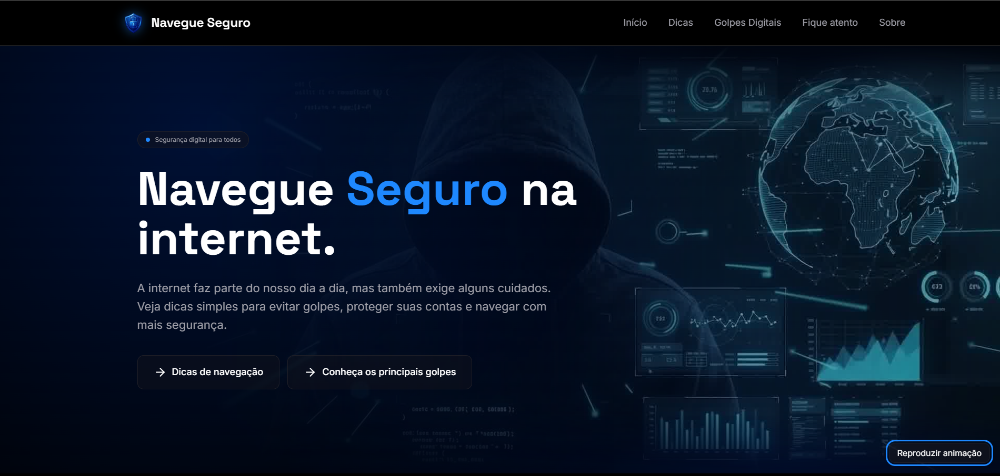

# Navegue Seguro

Portal educativo de segurança digital, desenvolvido como Atividade
Extensionista (Tecnologia Aplicada à Inclusão Digital) no curso de
Sistemas de Informação da UNINTER.

🔗 **Acesse o site:** ( link depois de publicar)

## Tópicos

- [Objetivo](#objetivo)
- [Público-alvo](#público-alvo)
- [Conteúdo](#conteúdo)
- [Acessibilidade](#acessibilidade)
- [Tecnologias](#tecnologias)
- [Privacidade](#privacidade)
- [Como executar](#como-executar)
- [Créditos](#créditos)
- [Desenvolvedora](#desenvolvedora)

## Objetivo

Como parte de um projeto de extensão acadêmica, este portal tem como objetivo aproximar a tecnologia da sociedade, fornecendo conteúdos educativos para ajudar os usuários a reconhecerem situações de risco online, prevenirem fraudes e navegarem com maior segurança.

## Público-alvo

O projeto é voltado à população em geral, com foco em pessoas que possuem pouco conhecimento sobre segurança digital, como idosos, jovens e usuários iniciantes na internet.

## Conteúdo

- **Dicas essenciais:** senhas fortes, autenticação em dois fatores, Wi-Fi
  público, verificação de endereços, atualizações e como desconfiar de
  mensagens urgentes
- **Golpes mais comuns:** phishing, golpe do PIX, falso suporte técnico,
  perfil falso, falso INSS e falsa vaga de emprego
- **Regra de ouro** e orientações sobre o que fazer em caso de dúvida ou golpe

## Acessibilidade

O site foi pensado para ser usado por todas as pessoas:

- **Uso pelo teclado:** todo o site pode ser usado sem mouse, com destaque
  visível do item selecionado e um atalho para pular direto ao conteúdo
- **Leitores de tela:** elementos identificados para que a navegação por voz
  funcione, com ícones decorativos ignorados
- **Menos movimento:** a animação de fundo respeita a preferência do sistema
  e tem botão para pausar e retomar
- **Texto legível:** letras de bom tamanho, cores com contraste adequado e
  linguagem direta
- **Celular e tablet:** layout adaptado às telas pequenas, com menu que abre
  e fecha e botões fáceis de tocar
- **Sem depender de JavaScript:** o conteúdo continua visível mesmo se ele
  falhar

Testado com o leitor de tela NVDA, além de Lighthouse (Acessibilidade 100
e Desempenho 99 no celular), WAVE e validadores de CSS e HTML do W3C.

## Tecnologias

HTML, CSS e JavaScript, sem frameworks.

## Privacidade

O site não coleta dados pessoais dos visitantes e não usa cookies.

## Como executar

Abra o arquivo `index.html` no navegador, ou use a extensão Live Server
do VS Code.

## Créditos

- Animação de fundo e logo criadas com inteligência artificial (Gemini e Google Flow)
- Fontes: Space Grotesk e Inter, via Google Fonts
- Ícones: Lucide

## Desenvolvedora

Gabrielle Oliveira Queiroz